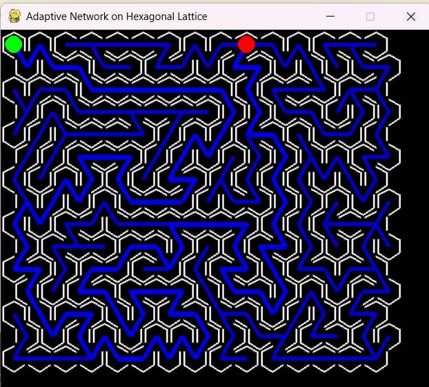

# Adaptive-Networks-on-Hexagonal-Maze

Solves a maze using adaptive networks using algorithm proposed by [Tero et al(2007)](https://doi.org/10.1016/j.jtbi.2006.07.015)

To run simulation type in the cmd line: `python main.py`

